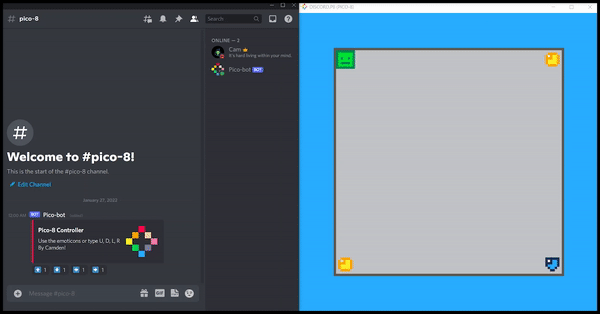

# Pico-8 Discord Bot

## Synopsis:
A Discord bot that controls Pico-8. Please let me know if you make any games with this tool!  
I will simplify the discord.p8 file soon...

## Requirements:
* [Python 3.7](https://www.python.org/)
* [Discord Library](https://pypi.org/project/discord.py/) - *pip install discord*
* On [Windows](https://www.codegrepper.com/code-examples/whatever/discord+ssl+certificate+error) and [Mac](https://pastebin.com/8Cs0C8c4) download a Discord certificate

## Usage:
* Put your Discord bot token into settings.txt
* Put discord.p8 into your Pico-8 cart folder
* Put the Pico-8 application location into settings.txt
* Put the Pico-8 cart folder location into settings.txt
* In your terminal: *python pico-bot.py (python3 on Mac and Linux)*

## Example:

## Support:
* Windows :heavy_check_mark:
* Linux: :question:
* Mac: :question:

  *(Testing on Linux and Mac later...)*
